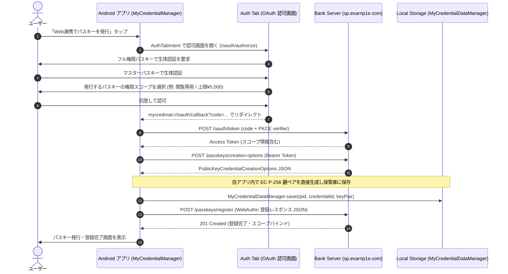
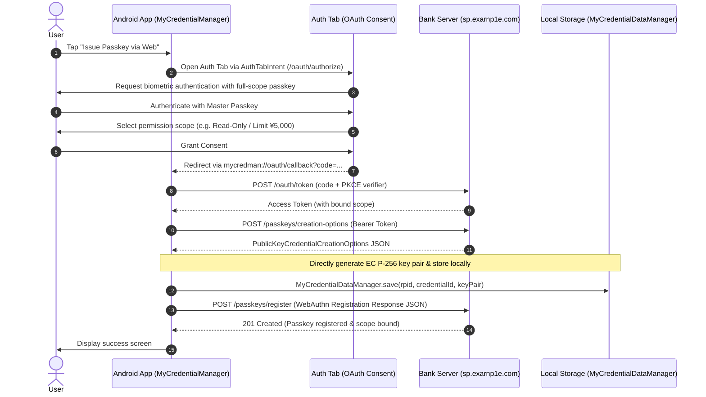

# My Credential Manager & Scoped Passkey Bank Demo

<p align="center">
  
</p>

<p align="center">
  <a href="#-日本語-japanese">日本語 (Japanese)</a> | <a href="#-english">English</a>
</p>

---

# 🇯🇵 日本語 (Japanese)

本リポジトリは、**Android 14+ の Credential Provider / Passkey 連携機能** と、Tim Cappalli 氏提唱の **Passkey Provisioning API** 仕様、および権限スコープ付きパスキー（**Scoped Passkey**）の検証用デモアプリケーションです。

Android クライアントアプリ（`app/`）および GCP Cloud Run 上で動作するモック銀行 Web サービス（`web/` - `https://sp.exarnp1e.com`）で構成されています。

---

## 🌟 主な機能と特徴

### 1. Passkey Provisioning API (Tim Cappalli 仕様準拠)
- **Auth Tab（`AuthTabIntent`）連携**:
  - Android アプリから Chrome Custom Tabs / Auth Tab を起動し、Web サービス側の OAuth 2.0 認可エンドポイントにアクセス。
  - PKCE（S256）によるセキュアな認可コードフローでアクセストークンを取得。
- **自アプリ内での直接パスキー生成（`DirectPasskeyCreator`）**:
  - OS の Credential Manager API ダイアログを経由せず、自アプリ（`MyCredentialManager`）内で直接 `EC P-256` 鍵ペアおよび 32 バイトの `credentialId` を生成。
  - アプリ内部の保管庫（`MyCredentialDataManager`）に直接保存し、生成した WebAuthn 登録レスポンス JSON をサーバーの Passkey Provisioning API（`POST /passkeys/register`）へ送信・登録。

### 2. 権限スコープ付きパスキー (Scoped Passkey)
銀行 Web サービス側で、発行するパスキーごとに操作権限（スコープ）を付与・制限できます。

| スコープ | 名称 | 送金権限 | パスキー追加権限 | 取引履歴閲覧 |
| :--- | :--- | :--- | :--- | :--- |
| `full` | **フル権限 (Full Access)** | ⭕ 無制限 | ⭕ 可能 | ⭕ 可能 |
| `limited_transfer` | **金額限定 (Limited Transfer)** | 🔺 設定上限額まで (例: ¥5,000) | ❌ 不可 | ⭕ 可能 |
| `read_only` | **閲覧専用 (Read Only)** | ❌ 不可 | ❌ 不可 | ⭕ 可能 |

- **初期登録**: Web 画面からの初回口座開設（初期残高 ¥100,000 付与）時に、マスターパスキー（`full`）を発行。
- **Android アプリ連携時の認可制御**:
  - Auth Tab 認可画面（`oauth-authorize.html`）での認証時、`full` 権限のパスキーでログインした場合のみ認可・スコープ設定が可能（閲覧専用などのパスキーでは認可不可）。

### 3. WebAuthn Signal API 実装
- **`PublicKeyCredential.signalUnknownCredential`**:
  - サーバーのデータベースに存在しないパスキーでログインを試行した場合（HTTP 404）、または Web ダッシュボードからパスキーを削除した場合にクライアント側で呼び出し、端末のパスキーマネージャー（Google パスワードマネージャー等）から不要なパスキーの削除・無効化シグナルを送信。
- **`PublicKeyCredential.signalAllAcceptedCredentials`**:
  - ダッシュボード読み込み時やパスキー更新時に、サーバーに登録されている全有効パスキー ID 一覧をパスキーマネージャーと同期。
- **`PublicKeyCredential.signalCurrentUserDetails`**:
  - ログイン成功時にユーザー名（`username`）および表示名（`displayName`）をパスキーマネージャーと同期。

### 4. モバイル対応レスポンシブ UI & 単一 JSON データストア
- **タブ切り替え UI**:
  - スマートフォン画面でも快適に操作できるよう、ダッシュボードを「💸 お振込み」「🔑 パスキー管理」「📜 取引履歴」の 3 つのタブで切り替え可能。
- **単一 JSON データストア**:
  - ユーザー情報、パスキー、口座残高、取引明細、OAuth コード/トークンをすべて `data/store.json` で一元管理し、Web UI 上の「DB JSON を確認」モーダルからリアルタイムに状態を確認可能。

---

## 🏗️ 処理フロー



---

## 📂 プロジェクト構成

```text
202608_scoped_passkey_demo/
├── app/                                    # Android クライアントアプリ
│   ├── src/main/java/com/example/mycredman/
│   │   ├── MainActivity.kt                 # メイン画面 / Credential Provider
│   │   ├── MyCredentialDataManager.kt      # ローカルパスキー保管庫 (SharedPref/JSON)
│   │   ├── MyCredentialProviderService.kt  # Android 14 CredentialProviderService
│   │   └── provisioning/
│   │       ├── AuthConfig.kt               # エンドポイント設定 (sp.exarnp1e.com)
│   │       ├── DirectPasskeyCreator.kt     # 自アプリ内直接鍵生成・WebAuthn JSON構築
│   │       ├── OAuthAuthTabManager.kt      # AuthTabIntent / PKCE 管理
│   │       ├── PasskeyProvisioningClient.kt # API クライアント (Token, Options, Register)
│   │       ├── PasskeyProvisioningScreen.kt # Jetpack Compose UI
│   │       └── PasskeyProvisioningViewModel.kt
│   └── src/main/AndroidManifest.xml
│
└── web/                                    # Scoped Passkey Bank Web サービス
    ├── data/
    │   └── store.json                      # 単一 JSON データストア
    ├── public/
    │   ├── index.html                      # メイン銀行画面 (タブUI)
    │   ├── app.js                          # フロントエンド WebAuthn & Signal API ロジック
    │   ├── styles.css                      # スタイル & レスポンシブ CSS
    │   └── oauth-authorize.html            # Auth Tab 認可・スコープ同意画面
    ├── src/
    │   ├── server.js                       # Express サーバー (WebAuthn, OAuth, Provisioning)
    │   ├── db.js                           # 単一 JSON DB レイヤー
    │   └── config.js                       # 環境変数 (RP_ID, ORIGIN)
    ├── test/                               # 単体テストスイート (node:test)
    ├── Dockerfile                          # Cloud Run 用コンテナ定義
    └── package.json
```

---

## 🚀 実行・デプロイ方法

### 1. Android アプリのビルド・実行
- **要件**: Android Studio Flamingo 以降, JDK 17 / 21, Android 14+ (API 34+) デバイスまたはエミュレータ。
- **ビルド & テスト**:
  ```bash
  ./gradlew assembleDebug testDebugUnitTest
  ```
- **実行**: Android Studio から `app` を起動。

### 2. Web サービスのローカル実行
- **要件**: Node.js 20+
- **起動**:
  ```bash
  cd web
  npm install
  npm run dev
  # http://localhost:8080 で起動
  ```
- **テスト実行**:
  ```bash
  cd web
  npm test
  ```

### 3. GCP Cloud Run へのデプロイ
```bash
cd web
gcloud run deploy scoped-passkey-bank \
  --project scoped-passkey-example \
  --source . \
  --region asia-northeast1 \
  --allow-unauthenticated \
  --set-env-vars RP_ID=sp.exarnp1e.com,ORIGIN=https://sp.exarnp1e.com
```

---

# 🇺🇸 English

This repository is a demonstration project showcasing **Android 14+ Credential Provider / Passkey capabilities**, the **Passkey Provisioning API** specification proposed by Tim Cappalli, and **Scoped Passkeys** (passkeys with granular permission scopes).

The project consists of an Android client app (`app/`) and a mock banking web service (`web/` - `https://sp.exarnp1e.com`) deployed on GCP Cloud Run.

---

## 🌟 Key Features

### 1. Passkey Provisioning API (Tim Cappalli Draft Spec)
- **Auth Tab (`AuthTabIntent`) Integration**:
  - Launches Chrome Custom Tabs / Auth Tab from the Android app to access the OAuth 2.0 authorization endpoint on the Web service.
  - Retrieves access tokens via secure PKCE (S256) authorization code flow.
- **Direct Passkey Generation (`DirectPasskeyCreator`)**:
  - Directly generates `EC P-256` key pairs and 32-byte `credentialId`s within the credential manager app itself (`MyCredentialManager`), bypassing the OS Credential Manager dialog.
  - Persists keys directly into the app's local vault (`MyCredentialDataManager`) and submits the standard WebAuthn registration response JSON to the Passkey Provisioning API (`POST /passkeys/register`).

### 2. Scoped Passkeys (Granular Permission Control)
The banking service allows configuring operational scopes per passkey:

| Scope | Name | Money Transfer | Add Passkey | View Transaction History |
| :--- | :--- | :--- | :--- | :--- |
| `full` | **Full Access** | ⭕ Unlimited | ⭕ Allowed | ⭕ Allowed |
| `limited_transfer` | **Limited Transfer** | 🔺 Up to configured limit (e.g. ¥5,000) | ❌ Denied | ⭕ Allowed |
| `read_only` | **Read Only** | ❌ Denied | ❌ Denied | ⭕ Allowed |

- **Initial Signup**: Creates a master passkey (`full` scope) upon account opening with an initial balance of ¥100,000.
- **Auth Tab Authorization Control**:
  - On the consent screen (`oauth-authorize.html`), only authentications made with a `full`-scope master passkey can grant consent and configure new passkey scopes.

### 3. WebAuthn Signal API Implementation
- **`PublicKeyCredential.signalUnknownCredential`**:
  - Invoked on the client when authenticating with a passkey that does not exist on the server (HTTP 404) or upon passkey deletion from the dashboard, notifying the client passkey manager (e.g., Google Password Manager) to remove/hide obsolete credentials.
- **`PublicKeyCredential.signalAllAcceptedCredentials`**:
  - Synchronizes all active credential IDs registered for the user with the client passkey manager on dashboard load and deletion.
- **`PublicKeyCredential.signalCurrentUserDetails`**:
  - Synchronizes user `name` and `displayName` upon successful authentication.

### 4. Responsive Tabbed UI & Single JSON Data Store
- **Tab Navigation**:
  - Optimized for mobile and desktop screens with segmented tabs: "💸 Transfer", "🔑 Passkeys", and "📜 History".
- **Single JSON Data Store**:
  - Manages users, passkeys, account balances, transactions, and OAuth tokens inside `data/store.json`, inspectable in real-time via the "View DB JSON" modal.

---

## 🏗️ Architecture Flow



---

## 🚀 Setup & Execution

### 1. Build and Run Android App
- **Requirements**: Android Studio Flamingo+, JDK 17 / 21, Android 14+ (API 34+) device or emulator.
- **Build & Test**:
  ```bash
  ./gradlew assembleDebug testDebugUnitTest
  ```

### 2. Run Web Service Locally
- **Requirements**: Node.js 20+
- **Start**:
  ```bash
  cd web
  npm install
  npm run dev
  # Runs on http://localhost:8080
  ```
- **Test**:
  ```bash
  cd web
  npm test
  ```

### 3. Deploy to GCP Cloud Run
```bash
cd web
gcloud run deploy scoped-passkey-bank \
  --project scoped-passkey-example \
  --source . \
  --region asia-northeast1 \
  --allow-unauthenticated \
  --set-env-vars RP_ID=sp.exarnp1e.com,ORIGIN=https://sp.exarnp1e.com
```