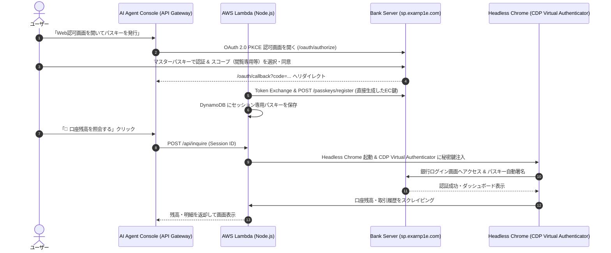
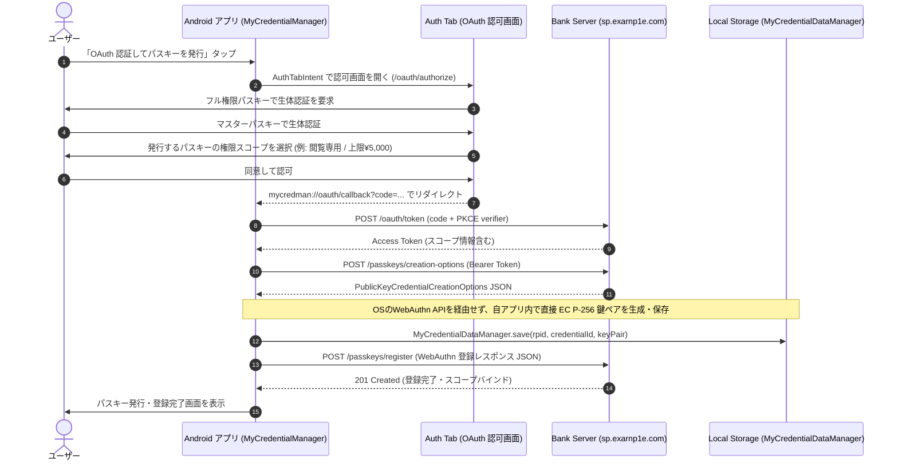

# Scoped Passkey Bank, AI Agent & My Credential Manager Demo

<p align="center">
  
</p>

<p align="center">
  <a href="#-日本語-japanese">日本語 (Japanese)</a> | <a href="#-english">English</a>
</p>

---

# 🇯🇵 日本語 (Japanese)

本リポジトリは、**モック銀行 Web サービス**（GCP Cloud Run）、**Headless Chrome による AI エージェント自動認証・残高照会**（AWS Lambda）、および **Android 14+ Credential Provider アプリ** を用いた、OAuth 2.0 PKCE 認可フローによる**パスキー直接プロビジョニング（Direct Registration）**と権限スコープ付きパスキー（**Scoped Passkey**）の総合検証デモプロジェクトです。

> [!NOTE]
> **💡 WebAuthn Direct Registration (WDR4W) と本提案の位置づけ**:  
> Tim Cappalli 氏によって提案された **[WebAuthn Direct Registration for Workforce (WDR4W)](https://github.com/timcappalli/explainers/tree/main/WebAuthnDirectRegistrationWorkforce)** は、企業・組織管理下の環境（**Managed Context / Workforce**）において、管理対象の Credential Manager やエンタープライズ構成を前提とした事前プロビジョニング仕様です。  
> 
> 一方で、本リポジトリの提案は Tim 氏の仕様公開前から独自に着想されていたものであり、企業管理下ではない一般コンシューマーや AI エージェント（**Non-Managed Context / Non-Workforce**）へのパスキー権限委譲・直接発行（Scoped Passkey）を目的としています。Tim 氏の先駆的な議論に深く敬意を払いつつ、本プロジェクトでは「コンシューマー向け金融サービスにおける AI エージェントへの権限制御付き自動認証」という独自のユースケースを実証しています。

本プロジェクトは以下の 3 つの主要コンポーネントで構成されています。

1. **モック銀行 Web サービス (`web/` - [https://sp.exarnp1e.com](https://sp.exarnp1e.com))**: GCP Cloud Run 上で動作する、権限スコープ付きパスキー、WebAuthn Direct Registration、および WebAuthn Signal API 対応の銀行サービス。
2. **AWS AI エージェント (`agent/` - [https://58p3ucbudc.execute-api.ap-northeast-1.amazonaws.com/](https://58p3ucbudc.execute-api.ap-northeast-1.amazonaws.com/))**: AWS Lambda (コンテナ) 上で Headless Chrome & CDP Virtual Authenticator を駆動し、Direct Registration で発行・保管したスコープ付きパスキーで自動ログイン・残高照会を行うエージェント。
3. **Android クライアントアプリ (`app/`)**: 自前でパスキー鍵ペアを生成・管理する Credential Provider アプリ。OAuth 2.0 PKCE 認可フローを通じて、OS の標準登録ダイアログ（WebAuthn API）を経由することなく、アプリ内で直接 EC P-256 鍵ペアを生成してパスキーを発行・登録（Direct Registration）可能。

> [!NOTE]
> **PoC環境におけるデータ保持期間について (GCP Cloud Run)**:  
> 本デモ銀行（`sp.exarnp1e.com`）はPoC用のインメモリデータストアで動作しており、データ整合性維持のため最大インスタンス数は `1` に設定されています。アクセスが途切れて約5分経過するとサーバーレスコンテナのアイドル停止に伴いデータ（登録パスキー・残高・取引明細）が自動消去されます。ログインできない場合は「新規口座開設」から再度ご登録ください。

---

## 🌟 主な機能と特徴

### 1. OAuth PKCE によるパスキー直接プロビジョニング (Direct Registration)
- **OAuth 2.0 PKCE 認可フロー**:
  - Android アプリ（Auth Tab）または AI エージェントから銀行の認可エンドポイント（`/oauth/authorize`）へアクセス。
  - フル権限（`full`）を持つマスターパスキーで生体認証・ログイン後、付与する権限スコープ（閲覧専用や送金上限）を選択して認可コードを発行。
- **クライアント側での直接鍵ペア生成 (Direct Registration)**:
  - アクセストークンを用いて `/passkeys/creation-options` を取得後、クライアント（Android アプリまたは Node.js Agent）内で直接 `EC P-256` 鍵ペアを生成。
  - OS のプラットフォーム登録ダイアログ（`navigator.credentials.create`）を経由することなく、生成した WebAuthn 登録レスポンス JSON を `/passkeys/register` へ送信してサーバー側にパスキーを登録。

### 2. 権限スコープ付きパスキー (Scoped Passkey)
発行するパスキーごとに操作権限（スコープ）を付与・制限できます。

| スコープ | 名称 | 送金権限 | パスキー追加権限 | 取引履歴閲覧 |
| :--- | :--- | :--- | :--- | :--- |
| `full` | **フル権限 (Full Access)** | ⭕ 無制限 | ⭕ 可能 | ⭕ 可能 |
| `limited_transfer` | **金額限定 (Limited Transfer)** | 🔺 設定上限額まで (例: ¥5,000) | ❌ 不可 | ⭕ 可能 |
| `read_only` | **閲覧専用 (Read Only)** | ❌ 不可 | ❌ 不可 | ⭕ 可能 |

- **初期登録**: Web 画面からの初回口座開設（初期残高 ¥100,000 付与）時に、マスターパスキー（`full`）を発行。
- **パスキーマネージャーでの衝突防止**: スコープ付きパスキー発行時に一意の `user.id`（userHandle）およびスコープ付きユーザー名（例: `alice+readonly@example.com`）を割り当て、同一端末のパスキーマネージャー上で重複せず区別可能。

### 3. AWS AI エージェント & Headless Chrome 自動認証 (`agent/`)
- **CDP Virtual Authenticator によるパスキー注入**:
  - Headless Chrome（Puppeteer-core）を起動し、Chrome DevTools Protocol (CDP) の Virtual Authenticator を通じて Vault に保管された EC 秘密鍵を注入。
  - WebAuthn アサーション署名を動的生成して自動ログインを実行。
- **ブラウザセッションごとの Vault 完全分離**:
  - 各訪問者ごとに一意のセッション ID（`sess_<random>`）が自動発行され、Cookie / Header で管理。
  - DynamoDB (`ScopedPasskeyVault`) 上でセッション単位にパスキーが独立保管されるため、複数ユーザー・複数アカウントの検証が安全に行えます。

### 4. WebAuthn Signal API 実装
- **`PublicKeyCredential.signalUnknownCredential`**:
  - サーバーのデータベースに存在しないパスキーでログインを試行した場合（HTTP 404）、または Web ダッシュボードからパスキーを削除した場合に呼び出し、パスキーマネージャーから不要なパスキーを削除・無効化。
- **`PublicKeyCredential.signalAllAcceptedCredentials`**:
  - ダッシュボード読み込み時やパスキー更新時に、有効なパスキー ID 一覧をパスキーマネージャーと同期。
- **`PublicKeyCredential.signalCurrentUserDetails`**:
  - ログイン成功時にユーザー名と表示名をパスキーマネージャーと同期。

---

## 🏗️ 処理フロー

### 1. Web サービス & AWS AI エージェントによる自動ログイン・残高照会


### 2. Android アプリによるパスキー直接プロビジョニング (Direct Registration)


---

## 📂 プロジェクト構成

```text
202608_scoped_passkey_demo/
├── web/                                    # Scoped Passkey Bank Web サービス
│   ├── data/
│   │   └── store.json                      # 単一 JSON データストア
│   ├── public/
│   │   ├── index.html                      # メイン銀行画面 (タブUI / 多言語対応)
│   │   ├── app.js                          # フロントエンド WebAuthn & Signal API ロジック
│   │   ├── styles.css                      # スタイル & レスポンシブ CSS
│   │   └── oauth-authorize.html            # Auth Tab 認可・スコープ同意画面
│   ├── src/
│   │   ├── server.js                       # Express サーバー (WebAuthn, OAuth, Provisioning)
│   │   ├── db.js                           # 単一 JSON DB レイヤー
│   │   └── config.js                       # 環境変数 (RP_ID, ORIGIN)
│   ├── test/                               # 単体テストスイート (node:test)
│   ├── Dockerfile                          # Cloud Run 用コンテナ定義
│   └── package.json
│
├── agent/                                  # AWS AI Agent (Headless Chrome + Scoped Passkey)
│   ├── src/
│   │   ├── browser/
│   │   │   └── virtual-authenticator.ts   # Puppeteer & CDP Virtual Authenticator 自動ログイン
│   │   ├── crypto/
│   │   │   └── passkey-generator.ts       # EC P-256 鍵ペア & WebAuthn 登録オブジェクト生成
│   │   ├── lambda/
│   │   │   └── web-app-handler.ts         # API Gateway HTTP API ハンドラー (セッション個別管理 / 多言語対応)
│   │   ├── provisioning/
│   │   │   └── oauth-provisioner.ts       # OAuth PKCE & Direct Registration 実行
│   │   ├── storage/
│   │   │   └── passkey-store.ts           # DynamoDB / ローカル Vault 保存レイヤー
│   │   ├── config.ts                      # 設定・環境変数
│   │   └── index.ts                       # ローカル開発用 HTTP サーバー
│   ├── test/                              # 暗号・署名検証テスト
│   ├── Dockerfile                         # AWS Lambda コンテナ定義 (Chrome & AL2023)
│   └── package.json
│
└── app/                                    # Android クライアントアプリ
    ├── src/main/java/com/example/mycredman/
    │   ├── MainActivity.kt                 # メイン画面 / Credential Provider
    │   ├── MyCredentialDataManager.kt      # ローカルパスキー保管庫 (SharedPref/JSON)
    │   ├── MyCredentialProviderService.kt  # Android 14 CredentialProviderService
    │   └── provisioning/
    │       ├── AuthConfig.kt               # エンドポイント設定 (sp.exarnp1e.com)
    │       ├── DirectPasskeyCreator.kt     # 自アプリ内直接鍵生成・WebAuthn JSON構築
    │       ├── OAuthAuthTabManager.kt      # AuthTabIntent / PKCE 管理
    │       ├── PasskeyProvisioningClient.kt # API クライアント (Token, Options, Register)
    │       ├── PasskeyProvisioningScreen.kt # Jetpack Compose UI
    │       └── PasskeyProvisioningViewModel.kt
    ├── src/main/res/                       # 多言語リソース (values/ & values-ja/)
    └── src/main/AndroidManifest.xml
```

---

## 🚀 実行・デプロイ方法

### 1. Web サービスのローカル実行 & Cloud Run デプロイ
- **ローカル起動**:
  ```bash
  cd web
  npm install
  npm run dev
  # http://localhost:8080 で起動
  ```
- **単体テスト**:
  ```bash
  cd web
  npm test
  ```
- **GCP Cloud Run へのデプロイ**:
  ```bash
  cd web
  gcloud run deploy scoped-passkey-bank \
    --project scoped-passkey-example \
    --source . \
    --region asia-northeast1 \
    --allow-unauthenticated
  ```

### 2. AWS AI エージェントのローカル実行 & Lambda デプロイ
- **ローカルテスト**:
  ```bash
  cd agent
  npm install
  npm test
  npm run dev
  # http://localhost:3000 で起動
  ```
- **AWS Lambda (ECR コンテナ) へのデプロイ**:
  ```bash
  cd agent
  npm run build
  aws ecr get-login-password --profile bedrock --region ap-northeast-1 | docker login --username AWS --password-stdin 609425363848.dkr.ecr.ap-northeast-1.amazonaws.com
  docker build --platform linux/amd64 -t 609425363848.dkr.ecr.ap-northeast-1.amazonaws.com/scoped-passkey-agent:latest .
  docker push 609425363848.dkr.ecr.ap-northeast-1.amazonaws.com/scoped-passkey-agent:latest
  aws lambda update-function-code \
    --function-name scoped-passkey-agent \
    --image-uri 609425363848.dkr.ecr.ap-northeast-1.amazonaws.com/scoped-passkey-agent:latest \
    --profile bedrock \
    --region ap-northeast-1
  ```

### 3. Android アプリのビルド・実行
- **要件**: Android Studio Flamingo 以降, JDK 17 / 21, Android 14+ (API 34+) デバイスまたはエミュレータ。
- **ビルド & テスト**:
  ```bash
  ./gradlew assembleDebug testDebugUnitTest
  ```
- **実行**: Android Studio から `app` を起動。

---

# 🇺🇸 English

This repository is a comprehensive demonstration showcasing a **Mock Banking Web Service** (GCP Cloud Run), **Automated Headless WebAuthn Authentication & Balance Inquiry** (AWS Lambda), and an **Android 14+ Credential Provider App**, implementing client-side **Direct Passkey Registration** via OAuth 2.0 PKCE, **Scoped Passkeys** (granular permissions), and the **WebAuthn Signal API**.

> [!NOTE]
> **💡 Relationship with WebAuthn Direct Registration for Workforce (WDR4W)**:  
> The **[WebAuthn Direct Registration for Workforce (WDR4W)](https://github.com/timcappalli/explainers/tree/main/WebAuthnDirectRegistrationWorkforce)** explainer proposed by Tim Cappalli focuses specifically on enterprise and organizational deployments (**Managed Context / Workforce** use cases).  
> 
> In contrast, the approach demonstrated in this repository was conceived independently prior to the publication of the WDR4W draft, addressing **Non-Managed Context / Non-Workforce & Consumer / Agent** use cases (e.g. consumer banking, personal AI agents, scoped financial permission delegation without MDM or enterprise infrastructure). While paying maximum respect to Tim Cappalli's pioneering work in the FIDO/W3C community, this project distinctly explores permission-scoped autonomous delegation in unmanaged, consumer-facing environments.

The project is organized into three major components:

1. **Mock Banking Web Service (`web/` - [https://sp.exarnp1e.com](https://sp.exarnp1e.com))**: Express service deployed on GCP Cloud Run supporting Scoped Passkeys, WebAuthn Direct Registration, and Signal API.
2. **AWS AI Agent (`agent/` - [https://58p3ucbudc.execute-api.ap-northeast-1.amazonaws.com/](https://58p3ucbudc.execute-api.ap-northeast-1.amazonaws.com/))**: Serverless container on AWS Lambda utilizing Headless Chrome and CDP Virtual Authenticator for automated passkey authentication and balance scraping using directly enrolled passkeys.
3. **Android Client App (`app/`)**: Credential Provider application with self-contained passkey generation and management. Supports direct client-side EC P-256 keypair creation and registration via OAuth 2.0 Authorization Code Flow (PKCE) without invoking OS-level WebAuthn platform dialogs (Direct Registration).

> [!NOTE]
> **Ephemeral In-Memory Data Store (GCP Cloud Run)**:  
> The mock banking service (`sp.exarnp1e.com`) operates with an in-memory data store, and max instances are set to `1` to maintain state consistency. After ~5 minutes of inactivity without incoming HTTP traffic, the serverless instance automatically terminates and all data (registered passkeys, balances, transaction logs) is reset. If you are unable to log in, please create a fresh account via "Sign Up" ("Open Account").

---

## 🌟 Key Features

### 1. Direct Passkey Registration via OAuth 2.0 PKCE (Direct Registration)
- **OAuth 2.0 PKCE Flow**:
  - Android App (via Auth Tab) or AI Agent connects to `/oauth/authorize`.
  - Authenticates with a full-access master passkey, chooses the requested operational scope, and issues an authorization code.
- **Direct Client Key Generation (Direct Registration)**:
  - Fetches `/passkeys/creation-options` with the access token and directly creates an `EC P-256` key pair on the client side without invoking OS-level WebAuthn platform dialogs (`navigator.credentials.create`).
  - Registers the generated WebAuthn response JSON via `POST /passkeys/register`.

### 2. Scoped Passkeys (Granular Permission Control)
Configure specific operational privileges per passkey:

| Scope | Name | Money Transfer | Add Passkey | View Transaction History |
| :--- | :--- | :--- | :--- | :--- |
| `full` | **Full Access** | ⭕ Unlimited | ⭕ Allowed | ⭕ Allowed |
| `limited_transfer` | **Limited Transfer** | 🔺 Up to configured limit (e.g. ¥5,000) | ❌ Denied | ⭕ Allowed |
| `read_only` | **Read Only** | ❌ Denied | ❌ Denied | ⭕ Allowed |

- **Collision Prevention**: Every scoped passkey is assigned a distinct user handle and scoped username (e.g., `alice+readonly@example.com`), allowing passkey managers to clearly differentiate multiple credentials for the same service.

### 3. Automated Headless WebAuthn Agent (`agent/`)
- **CDP Virtual Authenticator**:
  - Injects stored EC private keys into Headless Chrome via Chrome DevTools Protocol to dynamically generate valid WebAuthn assertion signatures for automatic login.
- **Isolated Per-Session Vault**:
  - Automatically provisions random Session IDs (`sess_<random>`) stored in cookies and headers.
  - Passkeys are isolated per session in DynamoDB (`ScopedPasskeyVault`), ensuring completely independent multi-user evaluations.

### 4. WebAuthn Signal API Implementation
- **`PublicKeyCredential.signalUnknownCredential`**: Signals passkey managers to delete obsolete credentials upon HTTP 404 or dashboard deletion.
- **`PublicKeyCredential.signalAllAcceptedCredentials`**: Synchronizes valid credential IDs on dashboard load.
- **`PublicKeyCredential.signalCurrentUserDetails`**: Synchronizes user details on login.

---

## 🚀 Setup & Execution

### 1. Web Service (Local & Cloud Run)
```bash
cd web
npm install
npm test
npm run dev

# Deploy to Cloud Run
gcloud run deploy scoped-passkey-bank --source . --region asia-northeast1 --project scoped-passkey-example --allow-unauthenticated
```

### 2. AWS AI Agent (Local & Lambda)
```bash
cd agent
npm install
npm test
npm run dev

# Deploy to AWS Lambda
npm run build
aws ecr get-login-password --profile bedrock --region ap-northeast-1 | docker login --username AWS --password-stdin 609425363848.dkr.ecr.ap-northeast-1.amazonaws.com
docker build --platform linux/amd64 -t 609425363848.dkr.ecr.ap-northeast-1.amazonaws.com/scoped-passkey-agent:latest .
docker push 609425363848.dkr.ecr.ap-northeast-1.amazonaws.com/scoped-passkey-agent:latest
aws lambda update-function-code --function-name scoped-passkey-agent --image-uri 609425363848.dkr.ecr.ap-northeast-1.amazonaws.com/scoped-passkey-agent:latest --profile bedrock --region ap-northeast-1
```

### 3. Android App
```bash
./gradlew assembleDebug testDebugUnitTest
```