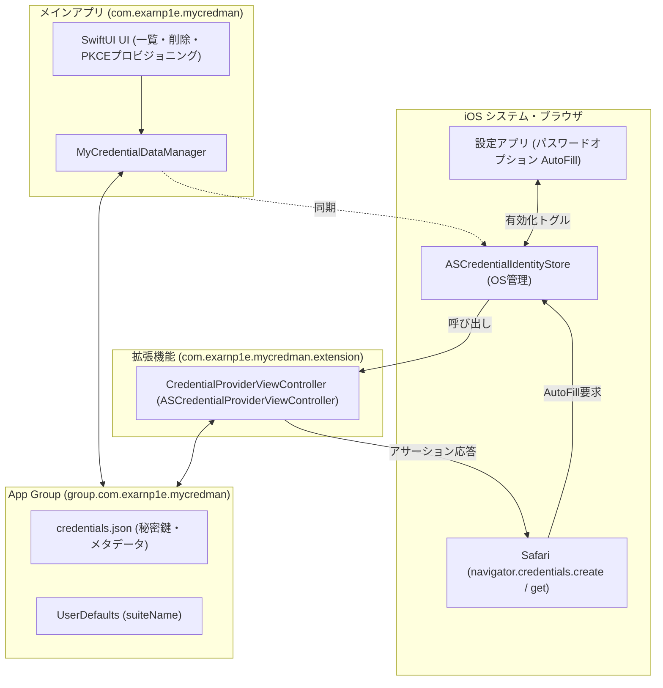

# iOS パスキー (Credential Provider & WebAuthn) 実機・シミュレータ検証ノウハウ & トラブルシューティングガイド

本ドキュメントは、iOS 上で自前のパスキー管理機能（**Credential Provider Extension** および **WebAuthn / Passkey 認証**）を実装・検証する過程で直面した技術的課題、原因究明、および解決策を汎用的な知見として体系化したものです。

---

## 目次
1. [アーキテクチャ概要と特有の難しさ](#1-アーキテクチャ概要と特有の難しさ)
2. [シミュレータの制約と「POSIX Error 163」問題](#2-シミュレータの制約とposix-error-163問題)
3. [実機デプロイ・プロビジョニング・CLI 自動化パイプライン](#3-実機デプロイプロビジョニングcli-自動化パイプライン)
4. [iOS 17+「Use Selected Passkey」無反応問題（バックグラウンド認証 API 差分）](#4-ios-17use-selected-passkey無反応問題バックグラウンド認証-api-差分)
5. [「全削除したのに Safari で使えてしまう」二重ゾンビ問題](#5-全削除したのに-safari-で使えてしまう二重ゾンビ問題)
6. [実機 XCUITest による自動化とスクリーンショット証跡取得ノウハウ](#6-実機-xcuitest-による自動化とスクリーンショット証跡取得ノウハウ)
7. [SwiftUI InsetGrouped List と AutoFill 状態の動的制御](#7-swiftui-insetgrouped-list-と-autofill-状態の動的制御)
8. [実装・検証チェックリスト](#8-実装検証チェックリスト)

---

## 1. アーキテクチャ概要と特有の難しさ

iOS におけるカスタムパスキーマネージャー（Credential Provider）は、以下の **3つの独立したプロセスとサンドボックス** が協調動作します：



### なぜテストやデバッグが難航するのか？
1. **プロセスの隔離**: メインアプリと Extension は別プロセス・別サンドボックスであり、メモリや標準の `UserDefaults.standard` は共有されない。
2. **OS システムシートのブラックボックス性**: Safari から呼ばれる Passkey シートは Apple の SpringBoard / システムプロセスが描画するため、UI 階層や内部エラーが直接アプリログに流れてこない。
3. **シミュレータと実機の挙動差**: Secure Enclave や生体認証（Face ID / Touch ID）、システム AutoFill ストアのシミュレーション実装が実機と乖離している。

---

## 2. シミュレータの制約と「POSIX Error 163」問題

### 発生した事象
Xcode シミュレータ（iPhone 16 / iOS 18 等）上で Safari から WebAuthn アサーション（`navigator.credentials.get`）を実行した際、システムシートが表示されず、または以下のエラーが発生して処理が中断する：
```text
Domain=NSPOSIXErrorDomain Code=163 "Device not configured"
```

### 根本原因
- シミュレータ環境では、ハードウェア Secure Enclave やプラットフォーム認証器（Platform Authenticator）の仮想化レイヤーに制約がある。
- システムの AutoFill クレデンシャル連携（`ASCredentialIdentityStore` → `ASCredentialProviderViewController`）において、シミュレータ固有の IPC（プロセス間通信）失敗により POSIX 163 が発生する。

### 汎用化できる知見・ノウハウ
> [!IMPORTANT]
> **テストスコープの明確な分離（シミュレータ vs 実機）**:
> 1. **シミュレータ / ユニットテストで検証すべきこと**:
>    - CryptoKit による P-256 鍵ペア生成・DER 署名生成ロジック
>    - WebAuthn CBOR AttestationObject / ClientDataJSON の構築
>    - App Group 内 JSON のエンコード・デコード
> 2. **実機（物理デバイス）でしか検証できないこと**:
>    - Safari / WebKit からの WebAuthn シートポップアップ
>    - iOS 設定アプリでの Credential Provider 有効化（AutoFill トグル）
>    - `ASCredentialIdentityStore` とシステムシートの完全な同期挙動
>    - `provideCredentialWithoutUserInteraction` によるサイレント認証

---

## 3. 実機デプロイ・プロビジョニング・CLI 自動化パイプライン

実機検証をスムーズに行うためには、Xcode GUI に依存せず、CLI（コマンドライン）から自動でビルド・インストール・実行できる環境を整えることが重要です。

### 1. Entitlements と Bundle ID の規約
メインアプリと Extension で以下の整合性を保つ必要があります：

| 対象 | メインアプリ | Extension |
| :--- | :--- | :--- |
| **Bundle ID** | `com.exarnp1e.mycredman` | `com.exarnp1e.mycredman.extension` (必ず親をプレフィックスにする) |
| **App Group** | `group.com.exarnp1e.mycredman` | `group.com.exarnp1e.mycredman` (完全一致) |
| **AutoFill Entitlement** | `com.apple.developer.authentication-services.autofill-credential-provider` = `true` | （同上） |

### 2. CLI によるビルド & 実機インストール定石コマンド

```bash
# 1. 実機の UDID を確認
xcrun devicectl list devices

# 2. 実機向けビルド (Xcode 15/16+)
xcodebuild build \
  -project MyCredMan.xcodeproj \
  -scheme MyCredMan \
  -destination 'platform=iOS,id=<DEVICE_UDID>' \
  -derivedDataPath build/DerivedDataDevice

# 3. 実機へのアプリインストール (devicectl)
xcrun devicectl device install app \
  --device <DEVICE_UDID> \
  build/DerivedDataDevice/Build/Products/Debug-iphoneos/MyCredMan.app

# 4. 実機上でのアプリ起動
xcrun devicectl device process launch \
  --device <DEVICE_UDID> \
  com.exarnp1e.mycredman
```

> [!TIP]
> **Xcode プロジェクト内の Runner / ターゲット重複に注意**:  
> Flutter や React Native からネイティブ Xcode プロジェクトを切り出した際、古いターゲットや重複するスキーム（`Runner` vs `MyCredMan`）が残っていると、プロビジョニングプロファイルが予期せぬターゲットに適用され、実機署名エラーの原因となります。不要なターゲットは明示的に除外・整理してください。

---

## 4. iOS 17+「Use Selected Passkey」無反応問題（バックグラウンド認証 API 差分）

### 発生した事象
Safari のパスキーサインインシートにおいて、提示されたパスキーの青いボタン「**Use Selected Passkey**（選択したパスキーを使用）」を何度タップしても、シートが閉じず認証が進まない（無反応に見える）。

### 根本原因
iOS 17 以降、システムシート上でユーザーが明示的に「パスキーを使用」を押下した際、OS は Extension に対して **「ユーザー操作を伴わないサイレント認証」** メソッドを呼び出す仕様に変更されました。

* **従来の非推奨メソッド (iOS 12-16)**:
  ```swift
  override func provideCredentialWithoutUserInteraction(for credentialIdentity: ASPasswordCredentialIdentity)
  ```
* **iOS 17+ で呼ばれる新メソッド**:
  ```swift
  override func provideCredentialWithoutUserInteraction(for credentialRequest: any ASCredentialRequest)
  ```

Extension 側で後者が未実装だったため、OS はアサーション完了通知（`completeAssertionRequest`）を待ち続けてハングアップしていました。

### 解決策（実装コードパターン）
`CredentialProviderViewController.swift` に以下を実装します：

```swift
@available(iOS 17.0, *)
override func provideCredentialWithoutUserInteraction(for credentialRequest: any ASCredentialRequest) {
    guard let passkeyRequest = credentialRequest as? ASPasskeyCredentialRequest else {
        self.extensionContext.cancelRequest(withError: NSError(
            domain: ASExtensionErrorDomain,
            code: ASExtensionError.userInteractionRequired.rawValue,
            userInfo: nil
        ))
        return
    }
    
    let identity = passkeyRequest.credentialIdentity
    let rpid = identity.relyingPartyIdentifier
    let credentialId = identity.credentialID
    
    // 1. App Group ストレージから該当パスキーの秘密鍵を取得
    guard let cred = MyCredentialDataManager.shared.load(rpid: rpid, credentialId: credentialId),
          let privateKey = cred.privateKey else {
        self.extensionContext.cancelRequest(withError: NSError(
            domain: ASExtensionErrorDomain,
            code: ASExtensionError.credentialIdentityNotFound.rawValue,
            userInfo: nil
        ))
        return
    }
    
    // 2. WebAuthn アサーション署名を生成
    let clientDataHash = passkeyRequest.clientDataHash
    guard let (signature, authData) = DirectPasskeyCreator.generateAssertionSignature(
        privateKey: privateKey,
        clientDataHash: clientDataHash,
        rpId: rpid
    ) else {
        self.extensionContext.cancelRequest(withError: NSError(
            domain: ASExtensionErrorDomain,
            code: ASExtensionError.failed.rawValue,
            userInfo: nil
        ))
        return
    }
    
    // 3. アサーションレスポンスを作成して OS に完了を通知
    let assertionCredential = ASPasskeyAssertionCredential(
        userHandle: cred.userHandle,
        authenticatorData: authData,
        signature: signature,
        clientDataHash: clientDataHash
    )
    
    self.extensionContext.completeAssertionRequest(using: assertionCredential)
}
```

---

## 5. 「全削除したのに Safari で使えてしまう」二重ゾンビ問題

### 発生した事象
アプリの管理画面で保存されたパスキーを全削除（Clear All）したにもかかわらず：
1. Safari のパスキーログインシートに、削除したはずのパスキーが依然として表示される。
2. そのパスキーを選択すると、認証が通りサーバーにログインできてしまう。

### 根本原因の特定
この問題は、**「表示のゾンビ」** と **「認証（秘密鍵）のゾンビ」** の 2 つのバグが複合して発生していました。

```mermaid
flowchart TD
    subgraph Issue1 ["バグ1: 表示のゾンビ (OSシステムストア)"]
        A["ユーザーが全削除実行 (0件)"] --> B["syncWithSystemStore()"]
        B --> C{"guard !identities.isEmpty else { return }"}
        C -->|0件なので早期リターン| D["removeAllCredentialIdentities が呼ばれない！"]
        D --> E["iOSシステムストアに旧パスキーが永久に残る"]
    end

    subgraph Issue2 ["バグ2: 認証のゾンビ (秘密鍵ストレージ)"]
        F["Extensionが loadAll() 実行"] --> G{"if !list.isEmpty"}
        G -->|空配列 [] を「取得失敗」と誤判定| H["UserDefaults.standard (旧キャッシュ) へフォールバック"]
        H --> I["古い秘密鍵で署名を正常生成してしまう"]
        I --> J["サーバー認証が成功してしまう"]
    end
```

### 汎用化できる知見・ノウハウ

#### 1. 空配列 `[]` と `nil`（未設定）の厳密な区別
データ永続化において、**「データが存在しない（nil）」** と **「データが 0 件として正常に保存されている（`[]`）」** は意味が全く異なります。
- `!list.isEmpty` で判定してフォールバックを行うと、「意図的な削除（0件）」がすべてフォールバックされて古いキャッシュが復活してしまいます。
- デコードに成功した配列（空配列を含む）があれば、それを確定データとして即座に返却すべきです。

#### 2. App Group を唯一の Single Source of Truth に統一する
メインアプリと Extension が連携する場合、個別サンドボックスの `UserDefaults.standard` へのフォールバックは **絶対に避けるべき** です。異なるプロセスがそれぞれ古い独自キャッシュを持つ原因になります。

#### 3. `ASCredentialIdentityStore` のアトミック更新
OS のクレデンシャルストアを更新する際は、全削除と更新で API を明確に使い分ける必要があります：

```swift
public func syncWithSystemStore() {
    let loaded = loadAll()
    if loaded.isEmpty {
        // 0件時は明示的に全削除 API を呼ぶ
        ASCredentialIdentityStore.shared.removeAllCredentialIdentities { success, error in
            print("System store cleared: \(success)")
        }
    } else {
        let identities = loaded.map { cred in
            ASPasskeyCredentialIdentity(...)
        }
        // 存在時は replace でアトミックに上書き
        ASCredentialIdentityStore.shared.replaceCredentialIdentities(identities) { success, error in
            print("System store updated: \(success)")
        }
    }
}
```

---

## 6. 実機 XCUITest による自動化とスクリーンショット証跡取得ノウハウ

### 発生した課題
- CI や自動テストエージェントで実機テストを行う際、テスト中の画面キャプチャを保存しようとすると、実機の iOS サンドボックス制限により macOS 上のファイルパス（`/Users/...`）へ直接書き込むことができない。

### 解決策: `.xcresult` 添付 & `xcresulttool` エクスポートパイプライン

#### 1. XCUITest 側で添付ファイルとして保持
```swift
private func saveScreenshot(name: String) {
    let screenshot = XCUIScreen.main.screenshot()
    let attachment = XCTAttachment(screenshot: screenshot)
    attachment.name = name
    attachment.lifetime = .keepAlways // テスト成功時も破棄しない
    add(attachment)
}
```

#### 2. ホスト（macOS）側で一括抽出
`xcodebuild test` 実行後に出力される `.xcresult` から `xcresulttool` で画像を取り出します：

```bash
# テスト実行
xcodebuild test \
  -project MyCredMan.xcodeproj \
  -scheme MyCredMan \
  -destination 'platform=iOS,id=<DEVICE_UDID>' \
  -only-testing:MyCredManUITests/SafariPasskeyE2ETests/testSavedPasskeysListAndSwipeToDelete \
  -derivedDataPath build/DerivedDataDevice

# 添付ファイル (PNG) をホスト側ディレクトリへ一括エクスポート
xcrun xcresulttool export attachments \
  --path build/DerivedDataDevice/Logs/Test/Test-*.xcresult \
  --output-path ./test_screenshots
```

これにより、手動操作を一切介さずに、実機上の UI 表示やスワイプ挙動の完全な画像証跡を取得・検証できます。

---

## 7. SwiftUI InsetGrouped List と AutoFill 状態の動的制御

### 1. InsetGrouped List でのボタンタップ競合防止
SwiftUI の `List`（特に `.insetGrouped`）の行セル内に通常の `Button` を配置すると、セル全体のタップとボタン押下が競合することがあります。
セクション内のボタンには必ず `.buttonStyle(.borderless)` を指定します：

```swift
Button(action: { ... }) {
    Text("設定を開く")
}
.buttonStyle(.borderless)
```

### 2. AutoFill 有効状態の監視と「チラつき防止（Zero-Flicker）」
設定アプリで AutoFill が有効になっている場合、初回起動時に案内パネルが一瞬表示されてから消える「チラつき（Flicker）」を防止するため、**「ローカルキャッシュ」＋「非同期最新取得」** のハイブリッド構成を採用します：

```swift
public final class MyCredentialDataManager: ObservableObject {
    private let autoFillEnabledKey = "IS_AUTOFILL_ENABLED_CACHE"
    @Published public var isAutoFillEnabled: Bool = false
    
    public init() {
        // 1. 直近のキャッシュ値で即座に初期化 (Flicker防止)
        self.isAutoFillEnabled = self.userDefaults.bool(forKey: autoFillEnabledKey)
        
        // 2. OS から真の最新状態を非同期取得して同期
        checkAutoFillStatus()
    }
    
    public func checkAutoFillStatus() {
        ASCredentialIdentityStore.shared.getState { state in
            DispatchQueue.main.async {
                withAnimation {
                    self.isAutoFillEnabled = state.isEnabled
                }
                self.userDefaults.set(state.isEnabled, forKey: self.autoFillEnabledKey)
            }
        }
    }
}
```

View 側では単純にプロパティを監視するだけで、スムーズな折りたたみアニメーションが実現します：
```swift
List {
    if !dataManager.isAutoFillEnabled {
        autoFillSection
    }
    ...
}
.listStyle(.insetGrouped)
```

---

## 8. 実装・検証チェックリスト

iOS Credential Provider / Passkey 機能を実装・リリースする際は、以下のチェックリストをご確認ください：

- [ ] **Entitlements**: メインアプリと Extension の両方に `autofill-credential-provider` が付与されているか？
- [ ] **App Group**: 両ターゲットで同一の `group.<bundle-id>` が設定され、コンテナ URL が解決できているか？
- [ ] **バックグラウンド認証**: `provideCredentialWithoutUserInteraction(for: any ASCredentialRequest)` が実装されているか？
- [ ] **完了通知**: あらゆる分岐（成功・失敗・キャンセル）で `extensionContext.complete...` または `cancelRequest` が呼ばれているか？
- [ ] **0件同期**: パスキー全削除時に `ASCredentialIdentityStore.shared.removeAllCredentialIdentities` が確実に呼ばれるか？
- [ ] **アトミック更新**: パスキー登録・更新時に `replaceCredentialIdentities` で OS ストアと同期しているか？
- [ ] **ストレージ分離**: `UserDefaults.standard` への不要なフォールバックを排除し、App Group のみを参照しているか？
- [ ] **空配列判定**: `isEmpty` で空配列を無視せず、0件データを「正常なクリア状態」として扱っているか？
- [ ] **実機テスト**: Safari からの新規登録（Registration）とログイン（Assertion）が実機物理デバイスで PASS しているか？
- [ ] **UI スワイプ削除**: リストから個別削除した際、即座に OS の AutoFill 候補からも消去されるか？

---

## 9. macOS / Mac Catalyst 対応時の特有問題と「続ける」無反応バグ

### 発生した事象
Mac Catalyst を用いて macOS 向けにビルドしたアプリにおいて、Safari でパスキーの「作成（新規登録）」または「認証（サインイン）」を試した際、Safari のネイティブモーダルシートが表示されるものの、**「続ける（Continue）」ボタンを押しても無反応で固まる（シートが進まない）**。

### 根本原因の究明プロセス
macOS のシステムログを `log show` で追跡した結果、以下の致命的エラーが判明：

```text
com.apple.AuthenticationServices.Helper: Failed to start plugin; pkd returned an error: Error Domain=PlugInKit Code=4 "RBSLaunchRequest error trying to launch plugin com.exarnp1e.mycredman.extension: Launch failed. Launchd job spawn failed. NSPOSIXErrorDomain Code=163"
kernel: (Sandbox) Sandbox: hook..execve() killing xpcproxy[pid=95938]: (err=22) failed to assign builtin profile
kernel: (AppleSystemPolicy) ASP: Security policy would not allow process: 95938, .../MyCredManExtension.appex/Contents/MacOS/MyCredManExtension
launchd: xpcproxy exited due to OS_REASON_EXEC (namespace: 9 code: 0x8)
```

1. **`com.apple.security.app-sandbox` 欠落による Kernel キル**:
   - iOS では全アプリ・機能拡張がデフォルトで OS により強制サンドボックス化されるため、entitlements に `app-sandbox` の明示指定は不要。
   - **しかし macOS では、App Extension (`.appex`) はカーネルの Sandbox Policy によりサンドボックス化が義務付けられている**。
   - Extension の entitlements に `<key>com.apple.security.app-sandbox</key><true/>` が欠落していたため、`launchd` の `xpcproxy` がバイナリを実行（`execve`）しようとした瞬間にカーネルが `(err=22) failed to assign builtin profile` でプロセスを即死（SIGKILL）させていた。
   - その結果、Safari 側のシートは Extension からの応答（`complete...`）を永久に待ち続け、「続ける」ボタンが無反応になった。

2. **Extension 内での `ASCredentialIdentityStore` 呼び出しの回避**:
   - `ASCredentialIdentityStore` は **ホストアプリ（メインアプリ）** が OS と同期するための API であり、サンドボックス化された Extension 内部から呼び出すと排他制御やパーミッションでブロックされるリスクがある。
   - `Bundle.main.bundlePath.hasSuffix(".appex")` で判定し、Extension 実行時はストア同期をスキップして App Group (`credentials.json`) の読み書きのみに専念させる必要がある。

3. **アサーション・登録の未完了ハングアップ防止**:
   - 対象ドメインのパスキーが見つからなかった場合に `return` だけで終了すると、OS シートがタイムアウトまで固まる。
   - 必ず `extensionContext.cancelRequest(withError: NSError(domain: ASExtensionErrorDomain, code: ASExtensionError.credentialIdentityNotFound.rawValue, ...))` を呼び出して速やかに OS に通知すること。

### 解決策のまとめ（macOS / Catalyst 必須設定）
1. `MyCredManExtension.entitlements` に `com.apple.security.app-sandbox = true` を追加。
2. `MyCredentialDataManager` で `isRunningInExtension` フラグを導入し、Extension 内での不要な `ASCredentialIdentityStore` 呼び出しを抑止。
3. `prepareInterface(forPasskeyRegistration:)` および `handleAssertionFlow` での即時応答・エラー通知を徹底。

